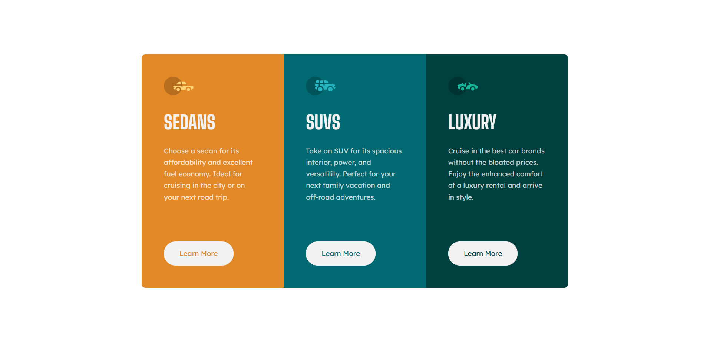

# Frontend Mentor - 3-column preview card component solution

This is a solution to the [3-column preview card component challenge on Frontend Mentor](https://www.frontendmentor.io/challenges/3column-preview-card-component-pH92eAR2-). Frontend Mentor challenges help you improve your coding skills by building realistic projects.

## Table of contents

- [Overview](#overview)
  - [Screenshot](#screenshot)
  - [Links](#links)
- [My process](#my-process)
  - [Built with](#built-with)
  - [Continued development](#continued-development)
- [Author](#author)

## Overview

### Screenshot

**Result for Desktop Design**

**Result for mobile Design**  

### Links

- Solution URL: https://github.com/RogeanCosta/frontendmentor-challenges/tree/main/3-column-preview-card-component
- Live Site URL: https://rogeancosta.github.io/frontendmentor-challenges/3-column-preview-card-component/

## My process

### Built with

- Semantic HTML5 markup
- CSS custom properties
- Grid CSS Layout

### Continued development

I would like to continue practicing CSS Grid Layout.

## Author

- Frontend Mentor - [@RogeanCosta](https://www.frontendmentor.io/profile/RogeanCosta)
- Linkedin - [@Rogean C.](https://www.linkedin.com/in/rogean-c-884a01b8)
