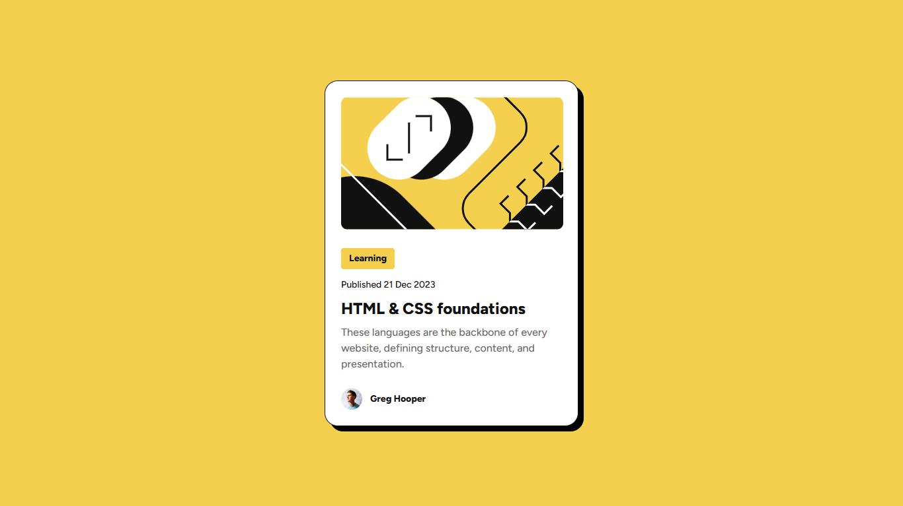
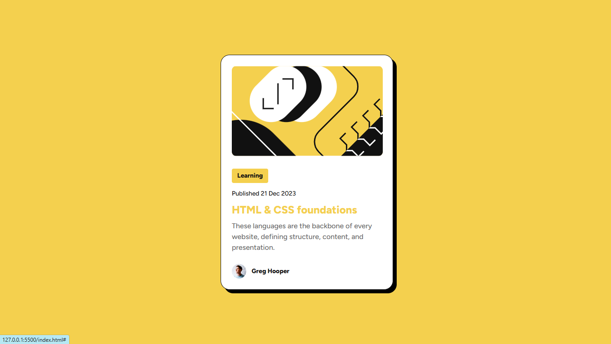

# Frontend Mentor - Blog preview card solution

This is a solution to the [Blog preview card challenge on Frontend Mentor](https://www.frontendmentor.io/challenges/blog-preview-card-ckPaj01IcS). Frontend Mentor challenges help you improve your coding skills by building realistic projects.

## Table of contents

- [Overview](#overview)
  - [The challenge](#the-challenge)
  - [Screenshot](#screenshot)
  - [Links](#links)
- [My process](#my-process)
  - [Built with](#built-with)
  - [What I learned](#what-i-learned)
  - [Continued development](#continued-development)
  - [Useful resources](#useful-resources)
- [Author](#author)
- [Acknowledgments](#acknowledgments)

## Overview

### Screenshot

**Result for Desktop Design**


**Result for hover/focus in Desktop Design**


### Links

- Solution URL: (https://github.com/RogeanCosta/frontendmentor-challenges/tree/main/blog-preview-card)
- Live Site URL: (https://rogeancosta.github.io/frontendmentor-challenges/blog-preview-card/)

## My process

### Built with

- Semantic HTML5 markup
- CSS custom properties
- Flexbox

### What I learned

In this challenge, I learned something new: How to work with @font-face to use fonts whose installation files are present in the project directories.

This is the first time I've done this and it was really exciting and challenging to learn how to do it. I was only used to using fonts through a connection with Google Fonts, not downloaded this way.

In addition, I was able to use knowledge acquired in the previous challenge to center the article completely in the center of the viewport with FlexBox. I ended up being able to use Flexbox in another situation too, to insert images and text in a single line.

```css
@font-face {
  font-family: 'Figtree';
  src: url(../fonts/Figtree-VariableFont_wght.ttf);
}

@font-face {
  font-family: 'Figtree';
  src: url(../fonts/Figtree-Italic-VariableFont_wght.ttf);
  font-style: italic;
}
```

### Continued development

I would like to continue improving and using FlexBox techniques in future projects. In addition, I am also interested in learning how to improve accessibility on a website.

### Useful resources

These two resources helped me a lot in this challenge:

- [Youtube Video](https://www.youtube.com/watch?v=lDip-1VnaOA) - This video set the stage for where to go about working with @font-face.
- [Stackoverflow Discussion](https://stackoverflow.com/questions/2436749/how-to-add-multiple-font-files-for-the-same-font) - This show me exactly what I have to do about @font-face rules.

## Author

- Frontend Mentor - [@RogeanCosta](https://www.frontendmentor.io/profile/RogeanCosta)
- Linkedin - [@Rogean Costa](https://www.linkedin.com/in/rogean-c-884a01b8)
