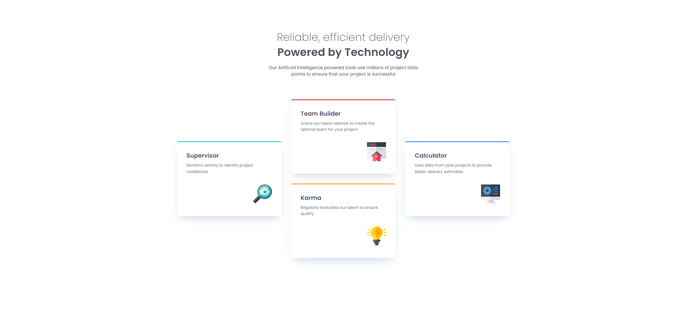
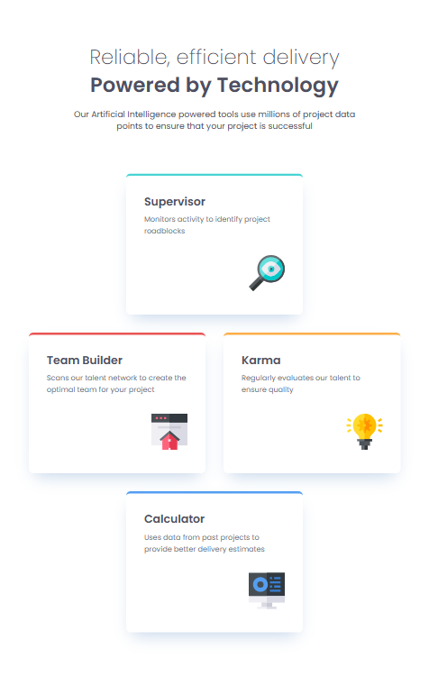

# Frontend Mentor - Four card feature section

This is a solution to the [Four card feature section coding challenge](https://www.frontendmentor.io/challenges/four-card-feature-section-weK1eFYK). Frontend Mentor challenges help you improve your coding skills by building realistic projects.

## Table of contents

- [Overview](#overview)
  - [Screenshot](#screenshot)
  - [Links](#links)
- [My process](#my-process)
  - [Built with](#built-with)
  - [Continued development](#continued-development)
- [Author](#author)

## Overview

### Screenshot

**Result for Desktop Design**

**Result for Tablet Design**  

**Result for Mobile Design**  
in construction....

<!--  -->

### Links

- Solution URL: https://github.com/RogeanCosta/frontendmentor-challenges/tree/main/four-card-feature-section
- Live Site URL: https://rogeancosta.github.io/frontendmentor-challenges/four-card-feature-section/

## My process

### Built with

- Semantic HTML5 markup
- CSS custom properties
- CSS utility classes
- Flexbox
- CSS Grid Layout

### Continued development

I would like to continue working with utility CSS classes, improving my knowledge on their best use. I would also like to continue constructing projects that use Flexbox and CSS Grid Layout.

## Author

- Frontend Mentor - [@RogeanCosta](https://www.frontendmentor.io/profile/RogeanCosta)
- Linkedin - [@Rogean C.](https://www.linkedin.com/in/rogean-c-884a01b8)
