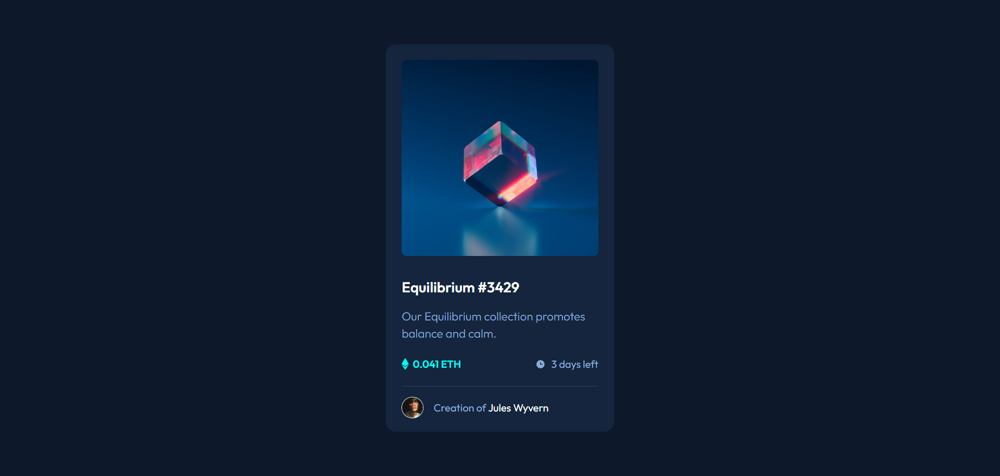
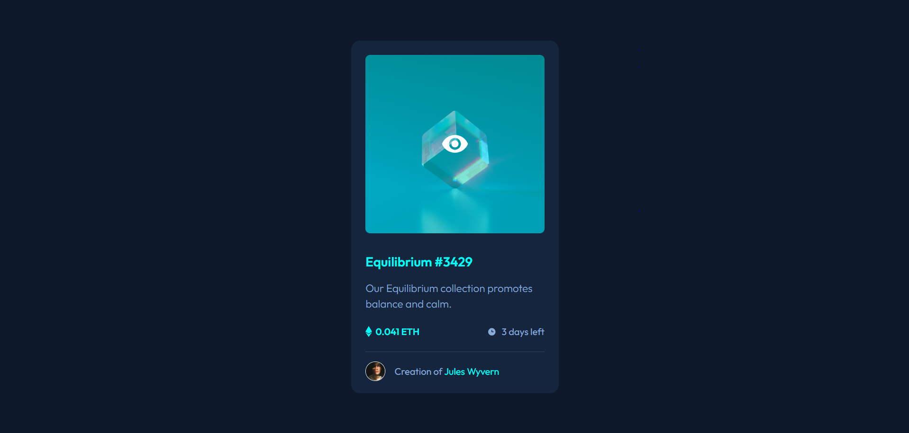
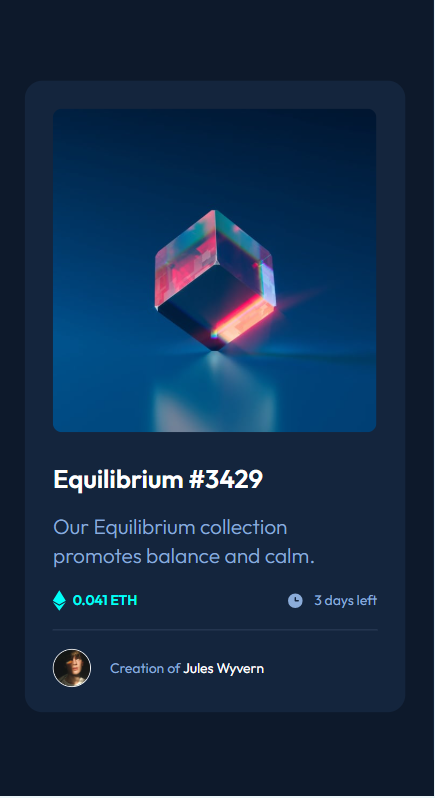

# Frontend Mentor - NFT preview card component solution

This is a solution to the [NFT preview card component challenge on Frontend Mentor](https://www.frontendmentor.io/challenges/nft-preview-card-component-SbdUL_w0U). Frontend Mentor challenges help you improve your coding skills by building realistic projects.

## Table of contents

- [Overview](#overview)
  - [Screenshot](#screenshot)
  - [Links](#links)
- [My process](#my-process)
  - [Built with](#built-with)
  - [What I learned](#what-i-learned)
  - [Continued development](#continued-development)
  - [Useful resources](#useful-resources)
- [Author](#author)

## Overview

### Screenshot

**Result for Desktop Design**


**Result for hover/focus in Desktop Design**


**Result for mobile Design**


### Links

- Solution URL: https://github.com/RogeanCosta/frontendmentor-challenges
- Live Site URL: https://rogeancosta.github.io/frontendmentor-challenges/nft-preview-card-component/

## My process

### Built with

- Semantic HTML5 markup
- CSS custom properties
- Flexbox

### What I learned

In this challenge, I learned how to apply a color to the image on hover/active and also add an icon on top of this color.

In HTML, a container is created with the content to be displayed on hover. This content will be positioned in the same location as the image and will initially have an opacity of 0, being completely transparent.

```html
<a class="occult-content" href="#">
  
</a>
```

In CSS, we work to position it at the image's location by setting a relative position on it and using absolute position on the hidden content. When hovering/active, the hidden content is then shown by setting the opacity to 1.

```css
.occult-content {
  width: 100%;
  height: 100%;
  border-radius: 0.5rem;
  position: absolute;
  top: 0;
  left: 0;
  background-color: var(--cyan-opacity);
  display: flex;
  flex-direction: column;
  justify-content: center;
  align-items: center;
  opacity: 0;
  transition: 0.15s;
}

.occult-content:hover {
  opacity: 1;
}
```

### Continued development

I would like to learn more techniques like the one explored in the hover in the image of this challenge, it is something really creative and fun to build.

### Useful resources

- [Add Text Overlays to Images on Hover with HTML & CSS](https://youtu.be/hr4JiDr7Aec) - This video helped me a lot in the process of creating the hover effect over the image.

## Author

- Frontend Mentor - [@RogeanCosta](https://www.frontendmentor.io/profile/RogeanCosta)
- Linkedin - [@Rogean C.](https://www.linkedin.com/in/rogean-c-884a01b8)
