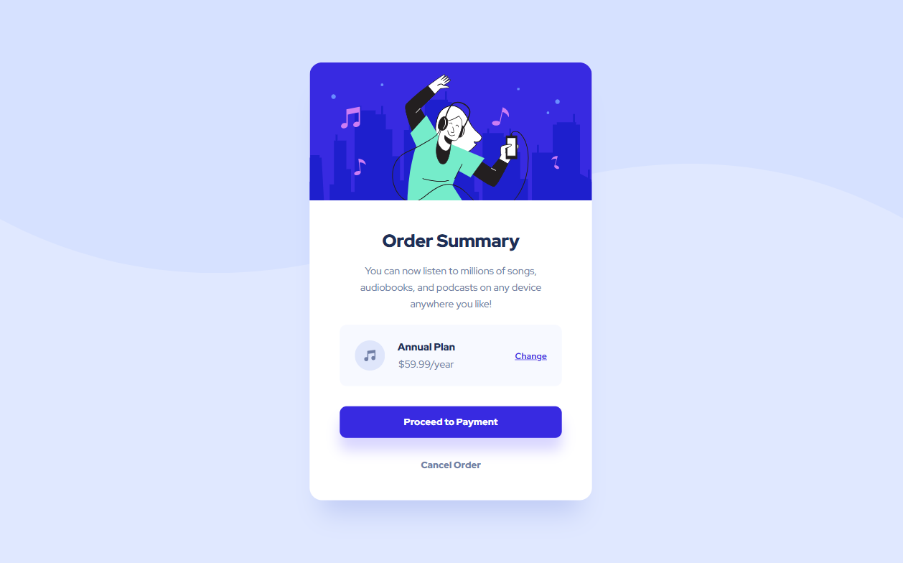
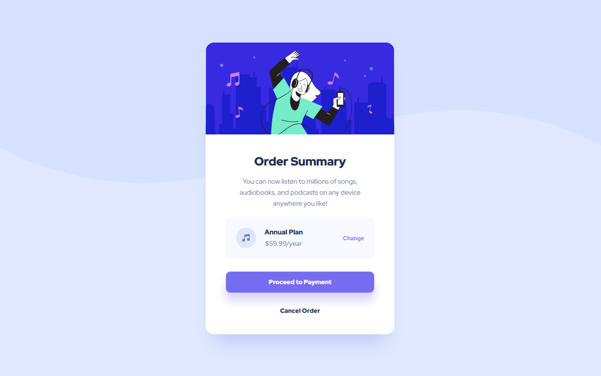

# Frontend Mentor - Order summary card solution

This is a solution to the [Order summary card challenge on Frontend Mentor](https://www.frontendmentor.io/challenges/order-summary-component-QlPmajDUj). Frontend Mentor challenges help you improve your coding skills by building realistic projects.

## Table of contents

- [Overview](#overview)
  - [Screenshot](#screenshot)
  - [Links](#links)
- [My process](#my-process)
  - [Built with](#built-with)
  - [What I learned](#what-i-learned)
  - [Continued development](#continued-development)
  - [Useful resources](#useful-resources)
- [Author](#author)

## Overview

### Screenshot

**Result for Desktop Design**


**Result for hover in Desktop Design**


**Result for mobile Design**
In construction...

<!--  -->

### Links

- Solution URL: <!--https://github.com/RogeanCosta/frontendmentor-challenges/tree/main/profile-card-component -->
- Live Site URL: <!--https://rogeancosta.github.io/frontendmentor-challenges/profile-card-component/-->

## My process

### Built with

- Semantic HTML5 markup
- CSS custom properties
- Flexbox

### What I learned

In this challenge, I learned how to stretch the background image so that it is edge-to-edge using the background-size property.

```css
.body {
  background: url(../images/pattern-background-desktop.svg) no-repeat top, #e0e8ff;
  background-size: contain;
}
```

### Continued development

I would like to continue learning about flexbox, learning to determine when I should actually use it and when I shouldn't.

### Useful resources

- [Stretch and scale a CSS image in the background - with CSS only](https://stackoverflow.com/questions/1150163/stretch-and-scale-a-css-image-in-the-background-with-css-only) - This stackoverflow discussion helped me with the issue of stretching an svg image in the background.

## Author

- Frontend Mentor - [@RogeanCosta](https://www.frontendmentor.io/profile/RogeanCosta)
- Linkedin - [@Rogean C.](https://www.linkedin.com/in/rogean-c-884a01b8)
