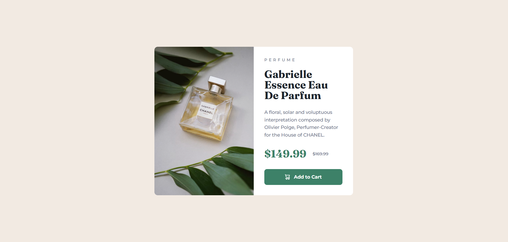
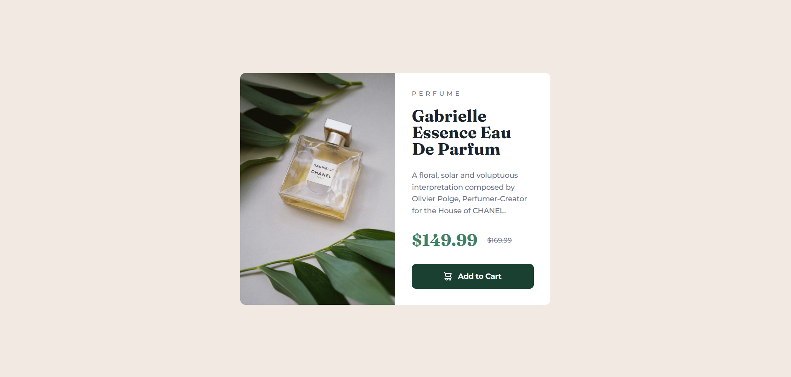

# Frontend Mentor - Product preview card component solution

This is a solution to the [Product preview card component challenge on Frontend Mentor](https://www.frontendmentor.io/challenges/product-preview-card-component-GO7UmttRfa). Frontend Mentor challenges help you improve your coding skills by building realistic projects.

## Table of contents

- [Overview](#overview)
  - [Screenshot](#screenshot)
  - [Links](#links)
- [My process](#my-process)
  - [Built with](#built-with)
  - [Continued development](#continued-development)
- [Author](#author)

## Overview

### Screenshot

**Result for Desktop Design**

**Result for hover in Desktop Design**

**Result for mobile Design**  

### Links

- Solution URL: https://github.com/RogeanCosta/frontendmentor-challenges/tree/main/product-preview-card-component
- Live Site URL: https://rogeancosta.github.io/frontendmentor-challenges/product-preview-card-component/

## My process

### Built with

- Semantic HTML5 markup
- CSS custom properties
- Flexbox

### Continued development

I would like to continue learning about flexbox, learning to determine when I should actually use it and when I shouldn't.

## Author

- Frontend Mentor - [@RogeanCosta](https://www.frontendmentor.io/profile/RogeanCosta)
- Linkedin - [@Rogean C.](https://www.linkedin.com/in/rogean-c-884a01b8)
