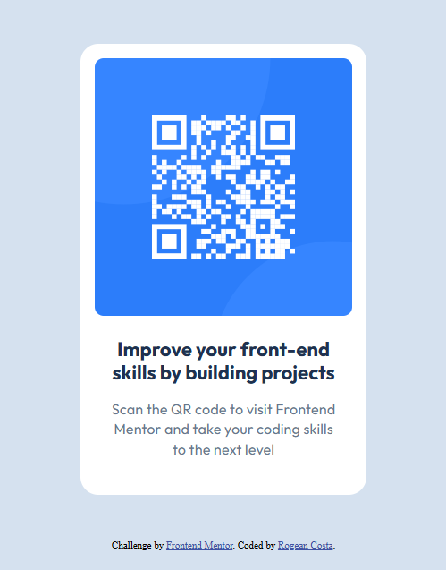

# Frontend Mentor - QR code component solution

This is a solution to the [QR code component challenge on Frontend Mentor](https://www.frontendmentor.io/challenges/qr-code-component-iux_sIO_H). Frontend Mentor challenges help you improve your coding skills by building realistic projects.

## Table of contents

- [Overview](#overview)
  - [Screenshot](#screenshot)
  - [Links](#links)
- [My process](#my-process)
  - [Built with](#built-with)
  - [What I learned](#what-i-learned)
  - [Continued development](#continued-development)
- [Author](#author)

## Overview

### Screenshot

### Links

- Solution URL: [Add solution URL here](https://github.com/RogeanCosta/frontendmentor-challenges/tree/main/qr-code-component-main)
- Live Site URL: [Add live site URL here](https://rogeancosta.github.io/frontendmentor-challenges/qr-code-component-main/)

## My process

### Built with

- Semantic HTML5 markup
- CSS Properties

### What I learned

In this challenge, I learned and gained experience on how to use other people's designs to build something new. I was able to apply some of the knowledge I have to build this project and review it. It was really challenging to use what I know to build something new on my own, but I enjoyed it.
By the way, just a comment, I didn't need work with Media Queries,it already adjust automatically.

### Continued development

In futures projects, I'd like to focus in study about page layout, especially how to centralize a container, and about semantic HTML markup, such as article, main, footer.
I would like to study about accessibility too.

## Author

- Frontend Mentor - [@RogeanCosta](https://www.frontendmentor.io/profile/RogeanCosta)
- Linkedin - [@Rogean Costa](https://www.linkedin.com/in/rogean-c-884a01b8)
