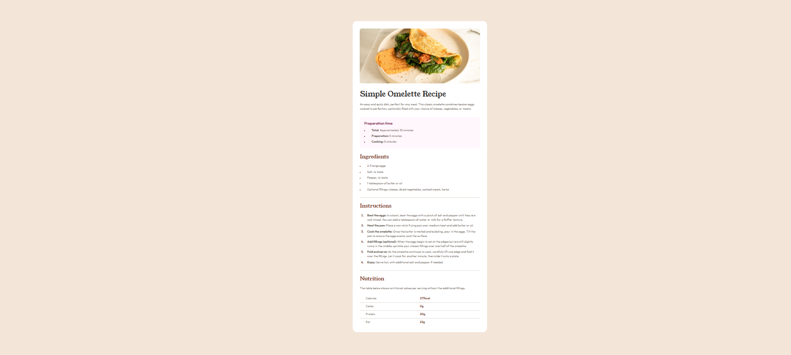

# Frontend Mentor - Recipe page solution

This is a solution to the [Recipe page challenge on Frontend Mentor](https://www.frontendmentor.io/challenges/recipe-page-KiTsR8QQKm). Frontend Mentor challenges help you improve your coding skills by building realistic projects.

## Table of contents

- [Overview](#overview)
  - [Screenshot](#screenshot)
  - [Links](#links)
- [My process](#my-process)
  - [Built with](#built-with)
  - [What I learned](#what-i-learned)
  - [Continued development](#continued-development)
- [Author](#author)

## Overview

### Screenshot



### Links

- Solution URL: [Add solution URL here](https://your-solution-url.com)
- Live Site URL: [Add live site URL here](https://your-live-site-url.com)

## My process

### Built with

- Semantic HTML5 markup
- CSS custom properties
- Flexbox

### What I learned

With this exercise, I learned how to work with tables. Adding all the necessary structure to the HTML and styling it using CSS.

```
<table>
  <tr>
    <th>Calories</th>
    <td>277kcal</td>
  </tr>
  <tr>
    <th>Carbs</th>
    <td>0g</td>
  </tr>
  <tr>
    <th>Protein</th>
    <td>20g</td>
  </tr>
  <tr>
    <th>Fat</th>
    <td>22g</td>
  </tr>
</table>

```

### Continued development

I've been having some issues with table styling so I'd like to dedicate myself and learn more about how to do this.

## Author

- Frontend Mentor - [@RogeanCosta](https://www.frontendmentor.io/profile/RogeanCosta)
- Linkedin - [@Rogean C.](https://www.linkedin.com/in/rogean-c-884a01b8)
