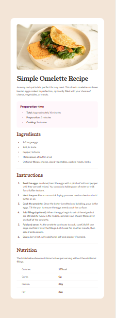

# Frontend Mentor - Recipe page solution

This is a solution to the [Recipe page challenge on Frontend Mentor](https://www.frontendmentor.io/challenges/recipe-page-KiTsR8QQKm). Frontend Mentor challenges help you improve your coding skills by building realistic projects.

## Table of contents

- [Overview](#overview)
  - [Screenshot](#screenshot)
  - [Links](#links)
- [My process](#my-process)
  - [Built with](#built-with)
  - [What I learned](#what-i-learned)
  - [Continued development](#continued-development)
- [Author](#author)

## Overview

### Screenshot

**Result for Desktop Design**


**Result for Tablet Design** </br>


**Result for Mobile Design** </br>


### Links

- Solution URL: https://github.com/RogeanCosta/frontendmentor-challenges/tree/main/recipe-page
- Live Site URL: https://rogeancosta.github.io/frontendmentor-challenges/recipe-page/

## My process

### Built with

- Semantic HTML5 markup
- CSS custom properties
- CSS utility classes
- Flexbox

### What I learned

With this exercise, I learned how to work with tables. Adding all the necessary structure to the HTML and styling it using CSS.

```html
<table>
  <tr>
    <th>Calories</th>
    <td>277kcal</td>
  </tr>
  <tr>
    <th>Carbs</th>
    <td>0g</td>
  </tr>
  <tr>
    <th>Protein</th>
    <td>20g</td>
  </tr>
  <tr>
    <th>Fat</th>
    <td>22g</td>
  </tr>
</table>
```

I also learned how to define and use utility CSS classes, just as they are used in CSS frameworks like Bootstrap.

```css
.text-p1 {
  font: 400 2.5rem/1 'Young';
  letter-spacing: 0px;
}

.text-p2 {
  font: 400 1.75rem/1 'Young';
  letter-spacing: 0px;
}

.text-p3 {
  font: 600 1.25rem/1 'Outfit';
  letter-spacing: 0px;
}
```

```css
.rose-50 {
  color: var(--rose-50);
}

.rose-800 {
  color: var(--rose-800);
}

/* Stone */
.stone-100 {
  color: var(--stone-100);
}

.stone-150 {
  color: var(--stone-150);
}

.stone-600 {
  color: var(--stone-600);
}
```

### Continued development

I would like to continue working with utility CSS classes, improving my knowledge on their best use. I would also like to dedicate some time to training and learning how to style list items, separating or joining the list-style of the item itself, as happened in this challenge.

## Author

- Frontend Mentor - [@RogeanCosta](https://www.frontendmentor.io/profile/RogeanCosta)
- Linkedin - [@Rogean C.](https://www.linkedin.com/in/rogean-c-884a01b8)
