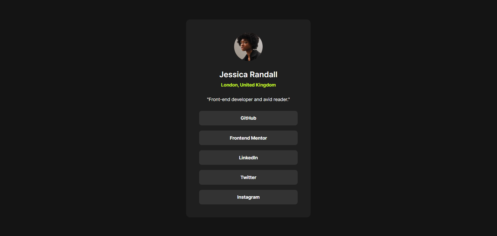
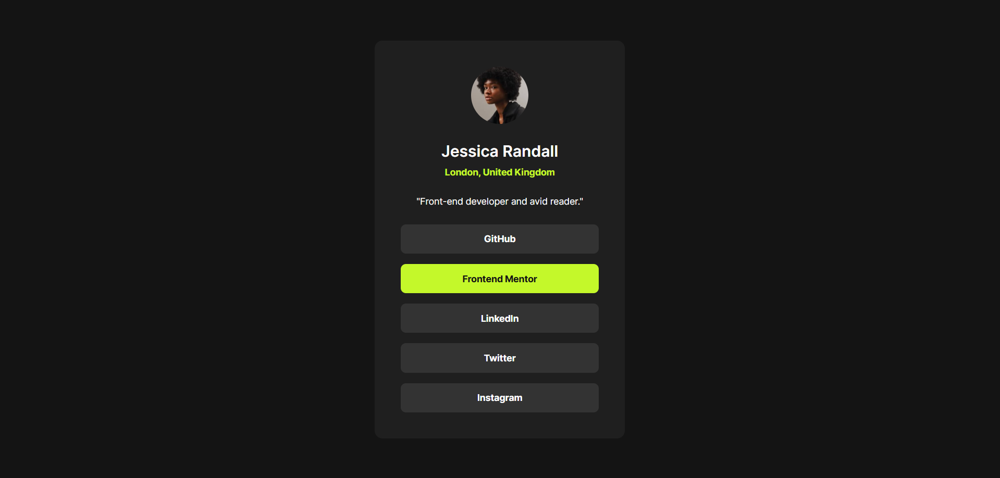

# Frontend Mentor - Social links profile solution

This is a solution to the [Social links profile challenge on Frontend Mentor](https://www.frontendmentor.io/challenges/social-links-profile-UG32l9m6dQ). Frontend Mentor challenges help you improve your coding skills by building realistic projects.

## Table of contents

- [Overview](#overview)
  - [Screenshot](#screenshot)
  - [Links](#links)
- [My process](#my-process)
  - [Built with](#built-with)
  - [What I learned](#what-i-learned)
  - [Continued development](#continued-development)
- [Author](#author)

## Overview

### Screenshot

**Result for Desktop Design**


**Result for hover/focus in Desktop Design**


### Links

- Solution URL: (https://github.com/RogeanCosta/frontendmentor-challenges/tree/main/social-links-profile)
- Live Site URL: (https://rogeancosta.github.io/frontendmentor-challenges/social-links-profile/)

## My process

### Built with

- Semantic HTML5 markup
- CSS custom properties
- Flexbox

### What I learned

In this challenge, I learned how to change cursor pointer to any image with cursor property:

```css
.element {
  cursor: url(../a_path/img.svg), auto;
}
```

### Continued development

I intend to continue improving my knowledge about building layouts with flexbox. I faced some problems with the links and I believe that a better understanding of flexbox could have helped me.

## Author

- Frontend Mentor - [@RogeanCosta](https://www.frontendmentor.io/profile/RogeanCosta)
- Linkedin - [@Rogean C.](https://www.linkedin.com/in/rogean-c-884a01b8)
